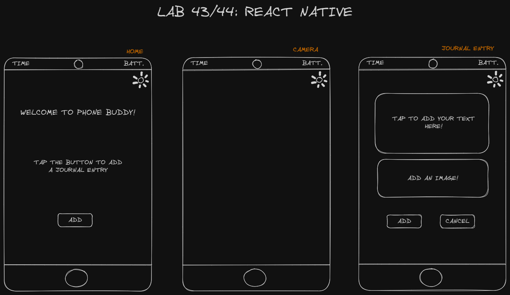

# LAB - Class 43/44

## Project: React Native

### Author: Ryan Eastman

### Problem Domain  

- **Lab 43: React Native**

The goal for this lab is to create our first native phone/device application using React Native, and tapping into at least 2 phone features (ie. contacts, location services, camera, etc). You will be required to create a new repo for this lab assignment, and build your application from scratch.

Over the next two lab sessions, we will create our first phone app. What it does and how it looks is entirely up to us. This is an opportunity to play around with what is possible in React Native and to get a feel for how we can get into the various device features.

*Phase One:* Focus on getting my dev system up and operational, getting "proof of life" and reaching MVP in terms of baseline functionality.

*Phase Two:* Add in additional features and functionality, and make it look good in preparation for presentation and deployment.

### Links and Resources

- [GitHub Actions ci/cd](https://github.com/DocHolliday13x/phoneBuddy/actions)
<!-- - [back-end server url](http://xyz.com)
- [front-end application](http://xyz.com) -->

### Collaborators

- Ryan Gallaway
- Reece Renninger
- Ike Steoger

### Setup

1. Initialize a new expo application
2. `npx create-expo-app --template`
3. `npm i` to install dependencies
4. `npx expo start` to start the app

#### `.env` requirements (where applicable)

for now I have none and do not require one

#### How to initialize/run your application (where applicable)

1. Clone the repo
2. Install the dependencies - `npm i`
3. Run the app - `npx expo start`

#### How to use your library (where applicable)

#### Features / Routes

- Feature One: Access to location services
- Feature Two: Access to camera/photos

#### Tests

- *How do you run tests?*
- *Any tests of note?*
- *Describe any tests that you did not complete, skipped, etc*

#### UML

- 
